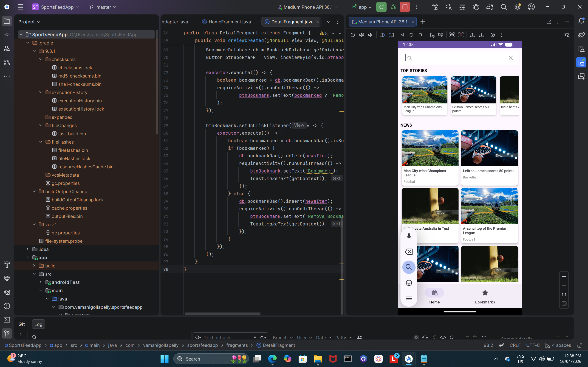
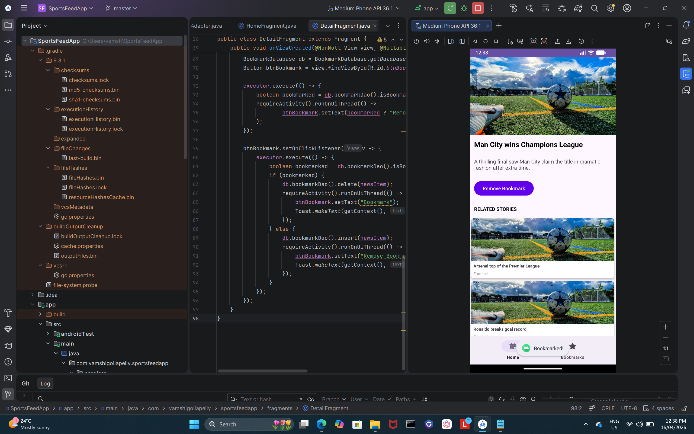
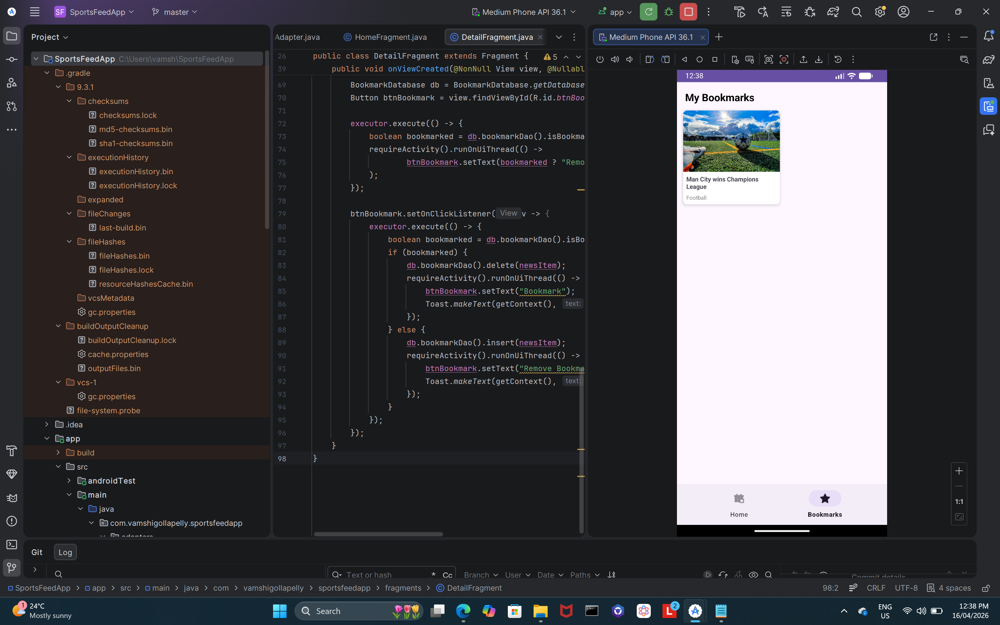

# SportsFeedApp

An Android news feed application for sports content, featuring a multi-screen layout, bookmark persistence, and category-based filtering. Built with Java using modern Android architecture patterns.

---

## Screenshots


| Home Feed | Story Detail | Bookmarks |
|---|---|---|
|  |  |  |

---

## Features

- **Featured matches row** — horizontal scrolling strip at the top of the home screen
- **News grid** — 2-column layout of latest stories below the featured section
- **Story detail view** — full story with image, title, description, and related stories
- **Search & filter** — filter news by sport category (Football, Basketball, Cricket, etc.)
- **Bookmarks** — save favourite stories; persisted locally with Room Database
- **Bottom navigation** — switch between Home and Bookmarks screens

---

## Tech stack


| Layer | Technology |
|---|---|
| Language | Java |
| UI | RecyclerView (grid + horizontal scroll), Fragments |
| Navigation | Android Navigation Component + Bottom Navigation |
| Persistence | Room Database (bookmarks) |
| Architecture | Single Activity, multi-Fragment |
| Build | Gradle |

---

## Architecture

```
app/
├── model/
│   └── Story.java                  # Data model
├── database/
│   ├── BookmarkDao.java            # Room DAO
│   └── BookmarkDatabase.java       # Room database instance
├── adapter/
│   ├── FeaturedAdapter.java        # Horizontal scroll RecyclerView
│   ├── NewsGridAdapter.java        # 2-column grid RecyclerView
│   └── RelatedStoriesAdapter.java  # Detail screen related stories
└── ui/
    ├── HomeFragment.java           # Feed + featured matches
    ├── DetailFragment.java         # Full story view
    └── BookmarksFragment.java      # Saved stories
```

---

## Screens

**Home screen**
- Featured matches in a horizontal `RecyclerView` at the top
- 2-column news grid using `GridLayoutManager`
- Search bar filters stories by sport category in real time

**Detail screen**
- Full story image, title, and description
- Related stories list at the bottom
- Bookmark toggle button — saves/removes from local database

**Bookmarks screen**
- All bookmarked stories retrieved from Room Database
- Persists across app restarts

---

## Getting started

### Prerequisites
- Android Studio Hedgehog or later
- Android SDK 26+
- Java 11+

### Run locally

```bash
git clone https://github.com/Vamshi-Gollapelly/SportsFeedApp.git
```

1. Open in Android Studio
2. Let Gradle sync
3. Run on emulator or physical Android device (API 26+)

> Note: News data is currently hardcoded as static dummy data for demonstration. A future improvement would be to integrate a live sports news API (e.g. NewsAPI or SportsDB).

---

## Planned improvements

- [ ] Integrate a live sports news API to replace hardcoded data
- [ ] Add pull-to-refresh on the home feed
- [ ] Filter by multiple categories simultaneously
- [ ] Dark mode support

---

## What I learned

- Building multi-screen Android apps with a Single Activity + Fragment pattern
- Using `GridLayoutManager` and `LinearLayoutManager` in the same screen
- Persisting user data with Room Database across app sessions
- Implementing real-time search/filter logic on a `RecyclerView` adapter

---

## Author

**Vamshi Gollapelly**
[LinkedIn](https://linkedin.com/in/vamshigollapelly) · [GitHub](https://github.com/Vamshi-Gollapelly) · [Email](mailto:vamshigollapelly225@gmail.com)
